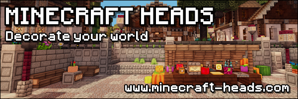

# Minecraft-Heads.com Integration for Minestom

## Overview
This library provides a seamless integration between [Minecraft-Heads.com](https://minecraft-heads.com/) and the Minestom server framework. It allows server developers to easily fetch and use custom player heads from the Minecraft-Heads.com database within their Minestom-powered Minecraft servers.

## Features
- Simple API for retrieving custom heads from Minecraft-Heads.com
- Caching system to reduce API requests (in compliance with Minecraft-Heads.com terms of use)
- Support for categories, tags, and search functionality
- Easy application of custom heads to Minestom entities and inventory items
- Lightweight implementation optimized for Minestom's performance-focused architecture

## Installation

### Maven
```xml
<dependency>
    <groupId>org.everbuild.minecraftheads</groupId>
    <artifactId>minecraft-heads-minestom</artifactId>
    <version>1.1.0</version>
</dependency>
```

### Gradle
```kotlin
implementation("org.everbuild.minecraftheads:minecraft-heads-minestom:1.10.0")
```
```groovy
implementation 'org.everbuild.minecraftheads:minecraft-heads-minestom:1.1.0'
```

## Important Note

> Note: In accordance to the API [ToS of minecraft-heads.com](https://minecraft-heads.com/terms-of-use), a back-linking banner needs to be placed on a website associated
> with the used feature, such as this one:

[](https://minecraft-heads.com/)

## License
This project is licensed under the MIT License, see the [LICENSE](LICENSE) file for details.


## Contributing
Contributions are welcome! Please feel free to submit a Pull Request.

## Acknowledgements
- [Minecraft-Heads.com](https://minecraft-heads.com/) for providing the head database
- [Minestom](https://github.com/Minestom/Minestom) for the lightweight Minecraft server framework